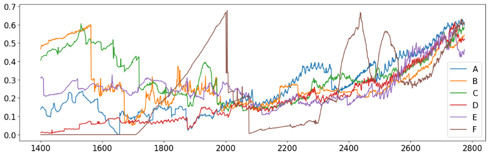
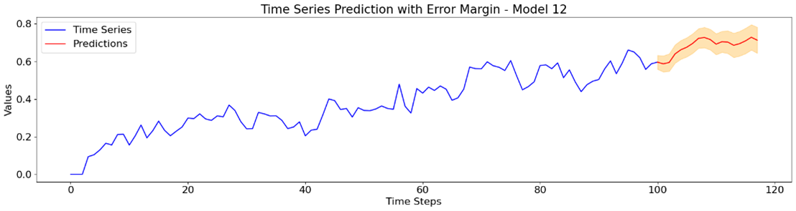
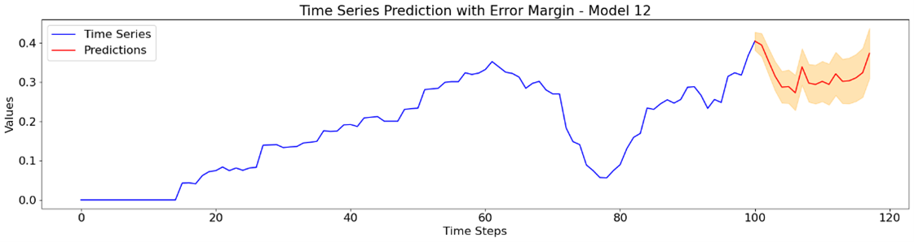
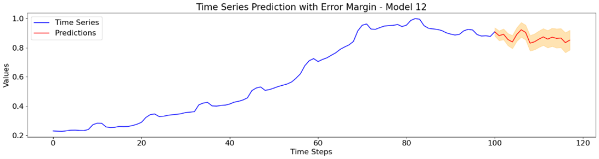
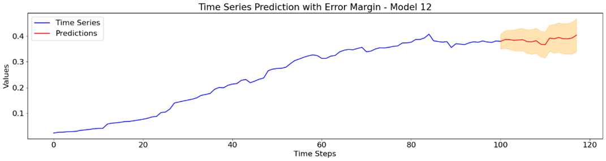
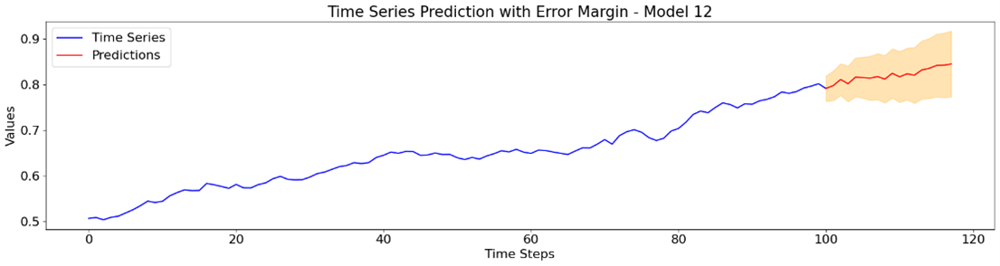
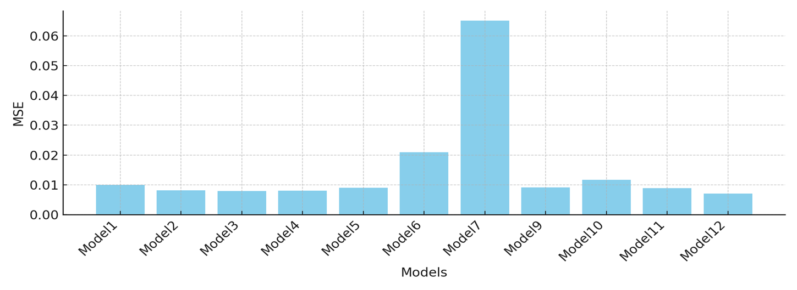

# DeepLearningHomework2

* Course: `ARTIFICIAL NEURAL NETWORKS AND DEEP LEARNING`
* Professor: `Prof. Dr. Matteucci Matteo`, `Prof. Dr. Giacomo Boracchi`
* University: `Politecnico di Milano`

## Introduction

This project focuses on forecasting time series data using a monovariate time series database composed of a single feature from six different domains. The provided dataset includes 48,000 time series, each with a length of 2776, and their associated category labels.

## Data Preparation

### Tackling Incomplete Time Series
- The dataset contains incomplete time series padded with zeros.
- We isolated the valid sequences and used a sliding window approach to generate new datasets for each category, each containing 20,000 sequences.
- The forecasting size is referred to as “telescope” in our code.

### Window Size
- We used the Autocorrelation Function (ACF) to determine the window size.
- Based on ACF analysis, a window size of 100 was selected.

### Robust Scaling
- Initially, we applied the robust scaler method to transform the data and reduce the influence of outliers.
- However, this method resulted in slightly worse performance, so we decided not to use it.

## Model Building

- We trained one model for each category to maximize performance.
- The selected model architecture is: **Conv1D + Bidirectional LSTM + Dense**.
- This architecture provided the best results with the lowest Mean Squared Error (MSE) and Mean Absolute Error (MAE).

## Layers Structure

- Various architectures were tested, including models with attention mechanisms and transformers.
- The final and best-performing model had the following structure:
  - Two Conv1D layers
  - Two MaxPooling layers
  - One Bidirectional LSTM layer
  - One Dense layer

## Model Comparison

| Index  | Model                                           | MSE      | MAE      |
|--------|-------------------------------------------------|----------|----------|
| Model1 | Only LSTM – 32 units                            | 0.009904 | 0.065101 |
| Model2 | Only LSTM – 64 units                            | 0.008178 | 0.058946 |
| Model3 | LSTM + Conv1D                                   | 0.00786  | 0.057928 |
| Model4 | Conv1D + LSTM + Conv1D + Dropout + Dense        | 0.007956 | 0.058067 |
| Model5 | LSTM + Conv1D + MaxPooling + Dense              | 0.008952 | 0.060758 |
| Model6 | Bidirectional LSTM + Conv1D + MaxPooling + Dropout + Dense | 0.02095  | 0.115252 |
| Model7 | Bidirectional LSTM + Conv1D + MaxPooling + Attention + Dense | 0.065147 | 0.215921 |
| Model8 | Transformer + Conv1D + Dense                    | 0.292562 | 0.476914 |
| Model9 | Bidirectional LSTM + Attention + Conv1D         | 0.009114 | 0.063025 |
| Model10| Bidirectional LSTM + Conv1D                     | 0.011673 | 0.072231 |
| Model11| Bidirectional LSTM + Attention + Transformer    | 0.008891 | 0.061596 |
| Model12| Conv1D + Bidirectional LSTM + Dense             | 0.00698  | 0.054648 |

## Final Implemented Solution

- The final model was a simple Conv1D + LSTM model with robust scaling for training, using a window size of 100.

## Results

- The best model (Model 12) demonstrated the lowest MSE and MAE values, indicating good predictive accuracy.

| MODEL | MSE      | MAE      |
|----------|----------|----------|
| 12        | 0.00698  | 0.054648 |

## Conclusion

- Our data preparation strategy involved selecting time series with the highest variance, ensuring high-quality training data.
- After testing various models, the Conv1D + Bidirectional LSTM + Dense architecture was the most effective, showing that simplicity can outperform more complex models in certain scenarios.

## Contributions

- **Filip Fabris**: Model testing, model comparison, sequence building, report
- **Maxime Pellichero**: Data preparation, model testing, robust scaling, sequence building, report
- **Jana Penic**: Dataset preparation, report
- **Mai Lan Pho**: Autocorrelation analysis, robust scaling, sequence building, report

## Dataset
You can access the dataset [here](https://drive.google.com/drive/folders/1kzHmzjhJ4FBvR-zFvvHf4ZXxK8X-i5sx?usp=sharing).

